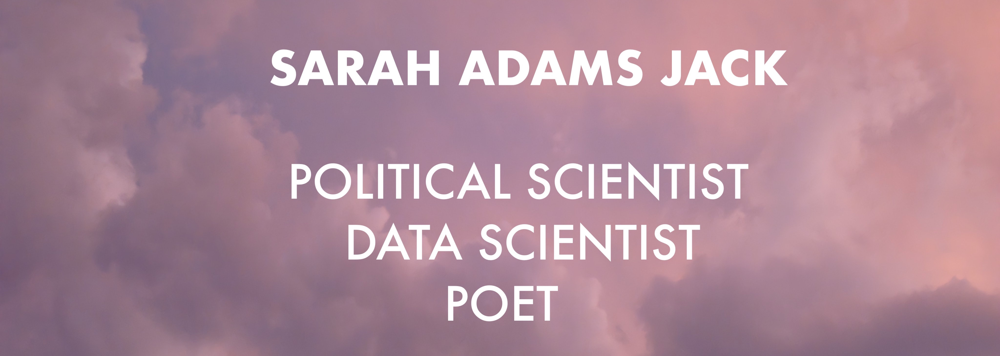

**Hello!**

Hi! My name is Sarah Jack and I'm a data scientist with a background in politics, social science and, poetry. I studied political science and history at Loyola University Chicago and recently graduated from Flatiron School's Data Science program. 

**What I'm up to!** 
- :books: Right now I'm part of a team that is developing RHINO's online poetry archive (thousands of poems!) check it out here: [RHINO poetry archive](https://rhinopoetry.org/poems "RHINO poetry archive")
- :computer: Working with civi.social to create a social network that directly connects elected officals to verified residents! [click to see our work in progress](https://civic-social-mvp.fly.dev/search)
- :speech_balloon: I'd to collaborate or chat about projects focused on civil engagement, social progress or the arts! 
- :cityscape: Chicago-based 

**Connect with me!**

[LinkedIn](https://linkedin.com/in/sarahadamsjack/ "LinkedIn") 

[Medium](https://medium.com/@sarahadamsjack "Medium") 

**Technical Skills**

